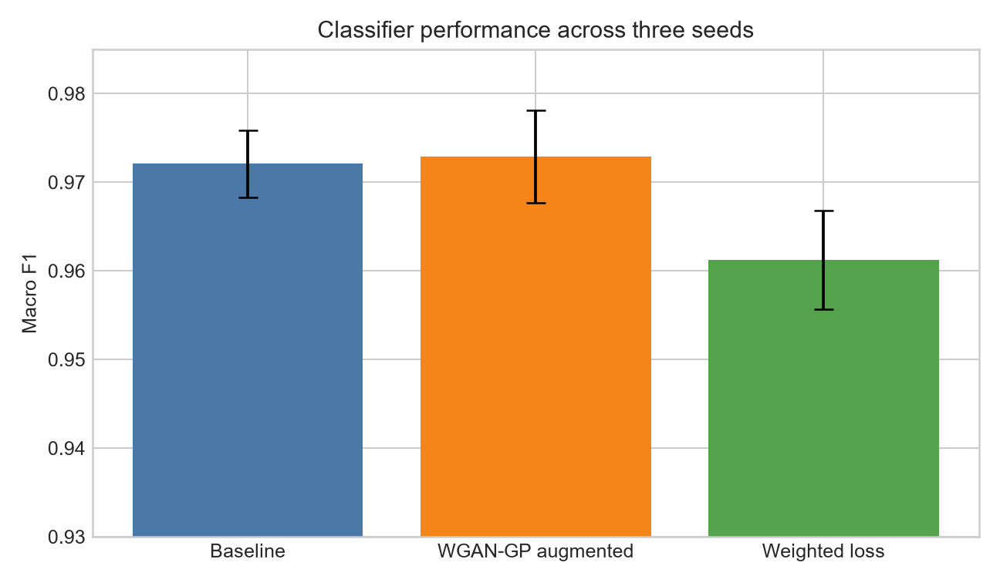
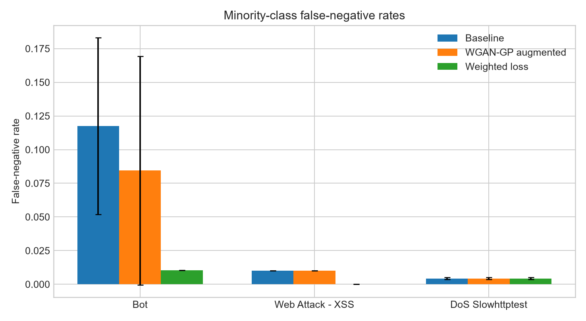
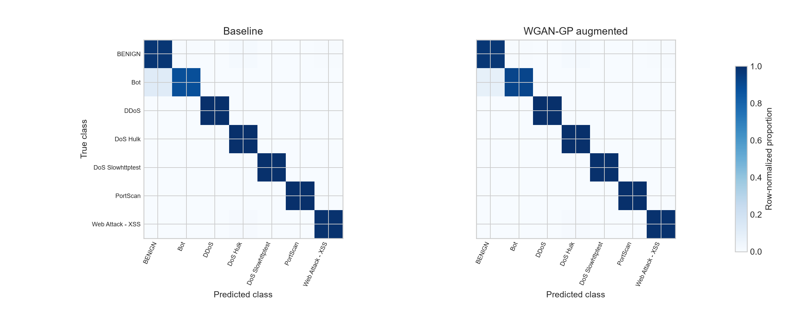
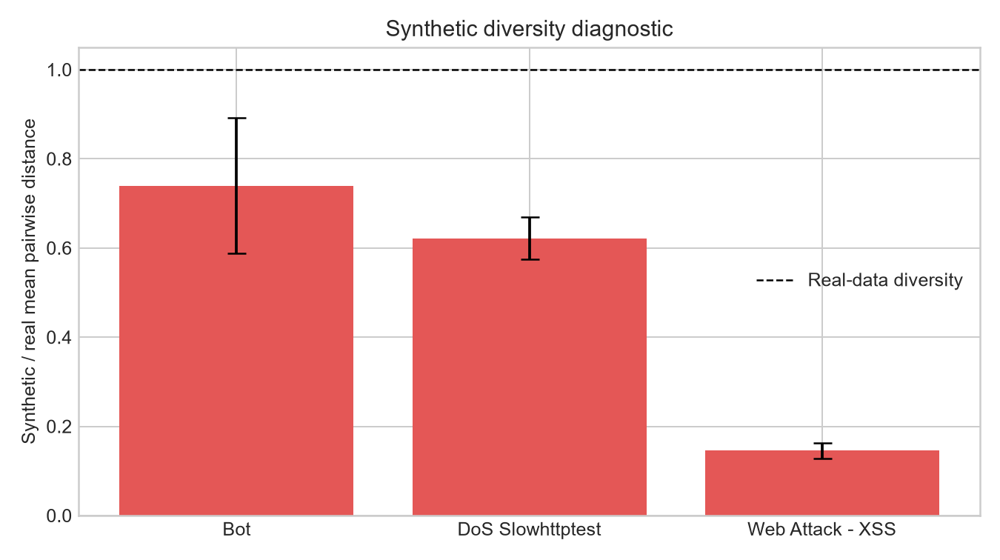

# Class-specific WGAN-GP augmentation for minority intrusion classes

## Research question

This pilot asks whether synthetic training observations from class-specific WGAN-GP models improve detection of minority network-intrusion classes in CICIDS2017. Class imbalance matters because a classifier can achieve high aggregate accuracy while missing attacks represented by relatively few flows. Here, augmentation means adding generated observations to the training partition for selected minority classes. Validation and test data contain only real observations.

The implemented model is class-specific WGAN-GP, not conditional WGAN-GP. The experiment trains a separate generator and critic for Bot, Web Attack - XSS, and DoS Slowhttptest. Class labels are not supplied to either network as conditioning inputs.

## Data and pilot scope

The experiment reads the CICIDS2017 flow CSV representation. It selects BENIGN, DDoS, DoS Hulk, PortScan, Bot, Web Attack - XSS, and DoS Slowhttptest. The three augmentation targets provide different minority sample sizes while excluding classes with only a few dozen observations, for which both GAN fitting and test estimates would be unreliable.

The loader applies deterministic per-class reservoir sampling with a cap of 20,000 rows. It selected 88,117 rows, removed 127 invalid rows, 7,004 exact duplicates, and 12 rows belonging to three feature vectors with conflicting labels. The resulting 80,974 observations were split into 56,681 training, 12,146 validation, and 12,147 test rows. Exact feature duplicates were removed before splitting.

The preprocessing pipeline removes near-constant features, standardizes features, and applies PCA. It fits every transformation on the real training partition only. PCA retained 23 components explaining at least 95% of training variance. The fitted transformation processes validation and test observations. Each WGAN-GP synthesizes new training observations directly in PCA space.

## Method

For a generator (G), critic (D), real class distribution (P_r), generated distribution (P_g), and interpolation distribution (P_{\hat{x}}), the critic minimizes

\[
L_D = \mathbb{E}_{\tilde{x}\sim P_g}[D(\tilde{x})]
- \mathbb{E}_{x\sim P_r}[D(x)]
+ \lambda\,\mathbb{E}_{\hat{x}\sim P_{\hat{x}}}
\left(\lVert\nabla_{\hat{x}}D(\hat{x})\rVert_2-1\right)^2.
\]

The pipeline constructs interpolated observations as

\[
\hat{x}=\epsilon x+(1-\epsilon)\tilde{x},
\qquad \epsilon\sim U(0,1),
\]

and the generator minimizes

\[
L_G=-\mathbb{E}_{z\sim U([-1,1]^d)}[D(G(z))].
\]

Here (x) is a real training observation from one class, (z) is a (d)-dimensional latent vector, and \(\lambda=10\) is the gradient-penalty coefficient. Each generator and critic uses hidden layers of 128, 128, and 64 units. Training uses 400 generator steps, five critic steps per generator step, Adam with learning rate \(10^{-4}\), and a class-specific training target of 5,000 observations.

The classifier is the same MLP in every condition, with hidden layers of 128 and 64 units. Real validation loss controls early stopping. The experiment compares:

1. an unweighted real-only baseline;
2. the same classifier with WGAN-GP observations added only to training data;
3. a real-only classifier using balanced sample weights.

For the weighted condition, observation weights derive from

\[
w_c=\frac{N}{C n_c},
\]

where (N) is the real training-set size, (C) is the number of classes, and (n_c) is the training count for class (c). No generated observation enters validation or test data. Seeds 42, 1, and 2 share the fixed real-data split and vary model initialization and stochastic training.

Evaluation uses macro F1, per-class precision, recall and F1, confusion matrices, and minority-class false-negative rate (\mathrm{FNR}_c=\mathrm{FN}_c/(\mathrm{TP}_c+\mathrm{FN}_c)=1-\mathrm{Recall}_c\). Multiclass ROC-AUC uses one-vs-rest probabilities because every test partition contains positive and negative observations for each class.

## Results

<!-- GENERATED_RESULTS_START -->

| Condition | Macro F1, mean ± SD | Macro ROC-AUC, mean ± SD | Runs |
|---|---:|---:|---:|
| Baseline | 0.9721 ± 0.0038 | 0.99909 ± 0.00004 | 3 |
| WGAN-GP augmented | 0.9729 ± 0.0052 | 0.99890 ± 0.00006 | 3 |
| Weighted loss | 0.9613 ± 0.0056 | 0.99902 ± 0.00013 | 3 |

<!-- GENERATED_RESULTS_END -->

The paired augmented-minus-baseline macro-F1 difference was (0.0008 \pm 0.0070). Augmentation improved Bot mean recall from 0.8824 to 0.9155, left XSS recall unchanged at 0.9898, and left Slowhttptest recall unchanged at 0.9957. XSS F1 decreased from 0.9327 to 0.9282. These mixed effects do not demonstrate a reliable overall benefit from augmentation in this pilot.





The row-normalized confusion matrices use the same real test observations in both conditions.



## Synthetic-data diagnostics

The generators produced 9,520 training observations per seed: 3,636 for Bot, 4,544 for XSS, and 1,340 for Slowhttptest. Across three seeds, mean synthetic-to-real pairwise-distance ratios were 0.740 for Bot, 0.145 for XSS, and 0.622 for Slowhttptest. XSS samples therefore occupy a substantially narrower region than the real XSS training observations. This diagnostic indicates collapse-like concentration; it does not establish distributional fidelity for the other generators.



## Reproduction

Use Python 3.11–3.14. Create an isolated environment and install all experiment dependencies:

```console
python -m venv .venv
.venv/Scripts/python -m pip install -e ".[dev,gan,report]"
```

Place one merged CICIDS2017 CSV under `data/raw/`, or pass its path directly. Do not combine a merged file with the eight daily files in one invocation.

```console
.venv/Scripts/python scripts/prepare_data.py --config configs/pilot.toml --csv data/raw/CICIDS2017.csv --output data/processed/pilot
.venv/Scripts/python scripts/run_baseline.py --config configs/pilot.toml --prepared data/processed/pilot --output results/pilot/baseline/seed_42 --seed 42
.venv/Scripts/python scripts/train_wgan_gp.py --config configs/pilot.toml --prepared data/processed/pilot --output results/pilot/wgan/seed_42 --seed 42
.venv/Scripts/python scripts/run_condition.py --condition augmented --config configs/pilot.toml --prepared data/processed/pilot --synthetic results/pilot/wgan/seed_42/synthetic_training_only.npz --output results/pilot/augmented/seed_42 --seed 42
.venv/Scripts/python scripts/run_condition.py --condition weighted --config configs/pilot.toml --prepared data/processed/pilot --output results/pilot/weighted/seed_42 --seed 42
```

Repeat the four model commands for seeds 1 and 2, aggregate their metrics, and regenerate every reported table and figure:

```console
.venv/Scripts/python scripts/aggregate_metrics.py --results-root results/pilot --seeds 42 1 2 --output results/pilot/aggregate.json
.venv/Scripts/python scripts/generate_report_assets.py --results-root results/pilot --figures figures --readme README.md --seeds 42 1 2
.venv/Scripts/python -m pytest
```

Preparation records the source filename and SHA-256 checksum. Each run saves metrics, predictions, losses, execution time, library versions, and hardware information. Raw data, transformed arrays, predictions, models, and checkpoints remain excluded from Git because of their size. JSON metrics, CSV summaries, and generated figures provide the compact result record.

## Limitations and next experiments

The experiment uses a capped cohort and a random flow-level split. Flows from the same capture session can remain similar across partitions, which may explain the high absolute scores. Three seeds quantify initialization variability but do not support strong statistical inference. PCA preserves variance rather than class-discriminative information. The synthetic diagnostics are descriptive and do not prove privacy, novelty, or distributional equivalence. XSS generation shows a clear diversity problem, and generated XSS observations outnumber real XSS training observations by roughly ten to one.

The next experiment should pre-register a session- or day-aware split, reduce synthetic-to-real ratios, select stopping criteria using real validation diagnostics, and compare WGAN-GP with random oversampling and SMOTE. A broader study should add more datasets and evaluate calibration, precision-recall AUC, nearest-neighbor privacy risk, and sensitivity to PCA dimensionality. Results should remain negative or inconclusive when executed metrics do not support improvement.
